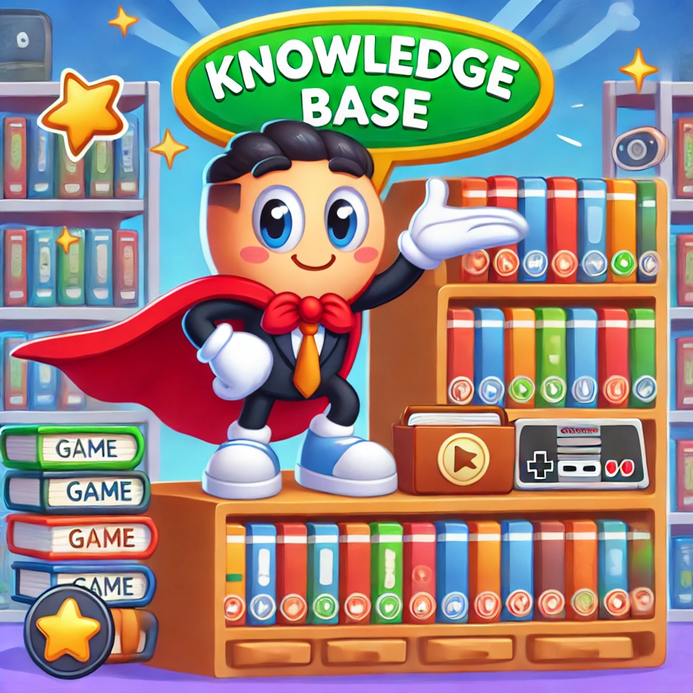
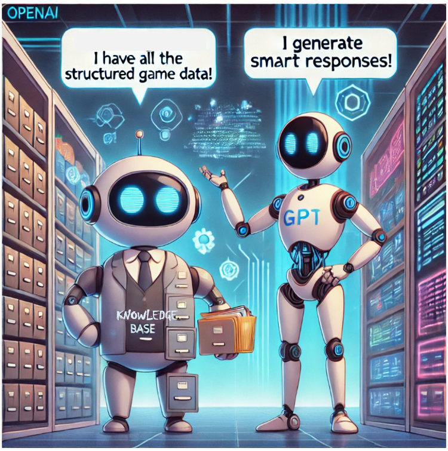
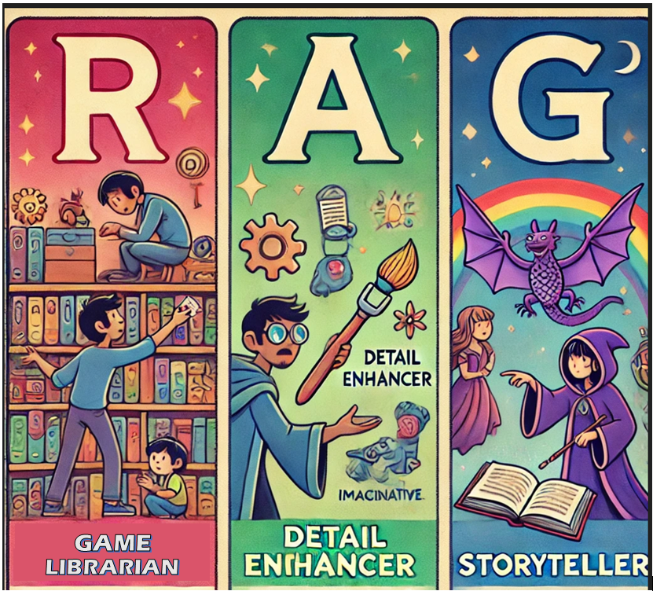
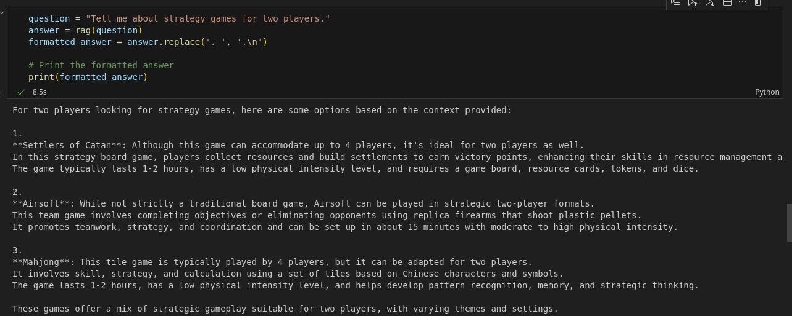
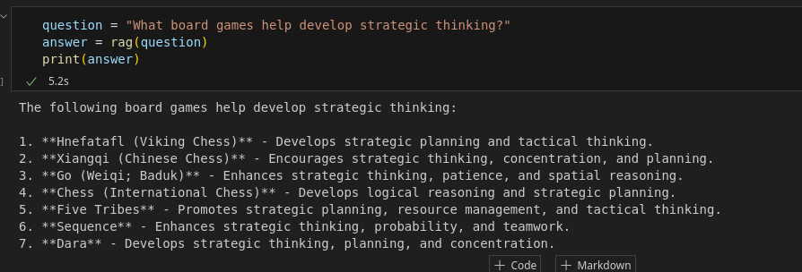

# Day 2: Unlocking the Power of RAG in Our Games Instructor Assistant

Imagine having a brilliant friend who not only knows every game imaginable but can also explain them in a way that's engaging and easy to understand. This is exactly what our **Games Instructor Assistant** does using a special technique called **RAG**—Retrieval-Augmented Generation.

In this guide, we'll explore how RAG works in our assistant, focusing on these key components:

- **Knowledge Base**
- **Indexing**
- **Retrieval**
- **Augmentation**
- **Generation**

Together, these elements create a seamless and powerful application that helps users find the perfect game every time!

---

## Knowledge Base: The Game Library

### What Is the Knowledge Base?

Think of the **Knowledge Base** as a well-organized library filled with detailed information about a wide variety of games. It's the foundation upon which our assistant is built.



- **Comprehensive Game Information**: It includes details such as :
  - **Game Name**
  - **Number of Players**
  - **Duration**
  - **Required Equipment**

- **Structured Data**: Organized in a way that makes it easy to search and retrieve information quickly.

### Why Is It Important?

- **Accurate Information**: Provides factual data about games, ensuring users get reliable recommendations.
- **Efficiency**: Enables quick access to a vast array of games without overwhelming the user.

In simple terms, a knowledge base is a super-organized guide that helps us remember and find all the games based on what people want to play, making the selection process enjoyable and efficient!

---
### Knowledge Base vs. LLM

When considering how a knowledge base compares to a Language Model (LLM):

| **Aspect**                | **LLM**                                        | **Knowledge Base**                             |
|---------------------------|------------------------------------------------|------------------------------------------------|
| **Analogy**               | Like a very smart friend who knows a lot but might occasionally get details wrong. | Think of it as an encyclopedia full of precise information about games. |
| **Pros**                  | Good at explaining in simple terms.           | Accurate information based on facts.           |
| **Cons**                  | Might "guess" answers or make mistakes.       | Can be dry and less engaging.                  |



### Why Combining Them Is Better

By integrating the LLM with the knowledge base:
- **Accuracy**: The knowledge base provides correct and up-to-date information.
- **Clarity**: The LLM explains answers in an approachable way.
- **Reliability**: Reduces the chances of incorrect answers since the LLM uses exact data from the knowledge base.

#### An Example

- **Just Asking the LLM**:
  - **You**: "What's a good game for 10-year-olds?"
  - **LLM**: "Maybe try 'Super Fun Game.'" (Could be a made-up game.)

- **Using Both Together**:
  - **You**: "What's a good game for 10-year-olds?"
  - **LLM checks the knowledge base and finds 'Hide and Seek.'**
  - **LLM**: "You could play 'Hide and Seek.' It’s a fun game for 10-year-olds where one person counts while others hide!"

In summary:
- The knowledge base serves as a **fact-checker**, ensuring information accuracy.
- The LLM acts as a **storyteller**, presenting information in an engaging way.
- Together, they provide correct answers with a friendly approach.

---


## Understanding the Knowledge Base in The Game Instructor Assistant

In our **Games Instructor Assistant**, we utilize two different methods for retrieving game information: **Minsearch** and **Weaviate**. Each has its own knowledge base.


## Minsearch: Text Search

### What is Minsearch?

- **Minsearch** is a lightweight search tool that finds games by matching exact words or phrases.
- **Fast and Simple**: Ideal for quickly locating specific games based on titles or clear descriptions.

### 📄 Knowledge Base in `minsearch`

- **In-Memory Storage**: 
  - The knowledge base in `minsearch.py` is a collection of game data stored directly in the application's memory.
  - **Structure**: Organized as a list of dictionaries, each representing a game with properties like name, description, category, age range, and more.
  
- **Example**:
  - A game entry includes details such as:
    - **gameName**: "Soccer"
    - **description**: "A team sport where players aim to score goals..."
    - **category**: "Outdoor Sports"
    - **ageRange**: "4+"
  
- **Purpose**:
  - Enables quick keyword-based searches using exact matches.
  - Ideal for straightforward queries where specific game details are requested.


## Weaviate: Vector Search

### What is Weaviate?

- **Weaviate** is an open-source vector search engine designed for semantic and context-aware searches.
- It utilizes **vector embeddings** to comprehend the meaning and context behind queries and data.

### 🧩 Knowledge Base in `weaviate`

- **Weaviate Vector Database**:
  - The knowledge base in `weaviate.py` is managed by **Weaviate**, a semantic vector search engine.
  - **Game Class**:
    - Defines the schema for storing game data in Weaviate.
    - **Properties**: Includes fields like `gameName`, `combined_text`, `description`, `playersMax`, `ageRange`, and others.
  
- **Example**:
  - A game object in Weaviate includes:
    - **gameName**: "Capture the Flag"
    - **combined_text**: "An outdoor game where two teams try to capture each other's flags..."
    - **playersMax**: 30
  
- **Purpose**:
  - Facilitates semantic and context-aware searches.
  - Suitable for complex queries where understanding the meaning behind words is essential.

---
## 🗂️ Indexing: Organizing for Quick Access

Before our assistant can efficiently retrieve information, the data in the knowledge base needs to be indexed.

### What Is Indexing?

- **Data Structuring**: Processes and organizes the data to allow fast and efficient searching.
- **Enhancing Search Performance**: Makes retrieval operations quicker by optimizing how data is stored and accessed.


### How Does It Work?

- **Text Fields**: Indexes game descriptions and other textual information.
- **Keyword Fields**: Indexes categories, age ranges, and other specific attributes.


### Importance of Indexing

- **Speed**: Proper indexing ensures that search queries return results quickly, enhancing user experience.
- **Accuracy**: Well-indexed data allows search engines to find the most relevant games based on the query.
- **Scalability**: As your game library grows, efficient indexing ensures that performance remains consistent.


### Reference to Indexing
For more detailed on the indexing process in minsearch and weaviate, please refer to the [Indexing with Minsearch](integration.md#12-how-indexing-works-with-minsearch) and [Indexing with Weaviate](integration.md#22-how-indexing-works-with-weaviate)

---
## 🚀 RAG: Retrieval-Augmented Generation


**RAG** combines the strengths of retrieval and generation to deliver accurate and engaging responses.


### How Does RAG Work?

1. **Retrieval**: Finds relevant information from the knowledge base.
2. **Augmentation**: Enhances the retrieved data with additional context.
3. **Generation**: Uses the data to generate a coherent and helpful response.

We utilize **GPT-4o-mini** as our Language Model (LLM) to generate user-friendly answers based on the retrieved information.
## 🔍 Retrieval: Finding the Right Games

When integrating the knowledge base with an LLM in our **Interactive Games Instructor Assistant**, the method of retrieving information is critical. Two primary approaches are **Text Search** and **Vector Search**. Let’s explore how these methods facilitate user queries effectively. 


- **Minsearch** for Text Search
- **Weaviate** for Vector Search
### Comparing Text Search and Vector Search

| **Aspect**          | **Text Search**            | **Vector Search**          |
| --------------- | --------------- | --------------- |
|**Matching Method**   | Exact keyword matching | Semantic similarity |
| **Understanding** | Literal interpretation of words | Contextual meaning  |
| **Use Case**        | Simple,specific queries             | Complex,open-ended queries             |
|**Implementation** | Simpler, uses traditional databases | More complex, uses machine learning models |
|**Results**|May miss relevant items with different wording|Finds relevant items regardless of exact wording|


---
For detailed instructions on integrating Minsearch and Weaviate, please refer to the [Integration Guide: Minsearch and Weaviate](integration.md).

## 🔍 Augmentation in Both Scripts

**Augmentation** enhances the retrieved game data to provide more detailed and relevant responses to user queries.

### How It Works:

1. **Retrieval**:
   - **Minsearch**: Fetches games based on exact keyword matches from the in-memory list.
   - **Weaviate**: Retrieves games based on semantic similarity using vector embeddings.

2. **Augmentation**:
   - The retrieved data is passed to the **Language Model (LLM)**.
   - The LLM uses this data as context to generate enriched and comprehensive answers.
   - **Minsearch Example**:
     - Uses game descriptions to provide detailed responses.
   - **Weaviate Example**:
     - Utilizes the combined text and other properties to craft more nuanced answers.

3. **Generation**:
   - The LLM generates user-friendly responses that incorporate both the retrieved information and additional insights from its training.

### Key Points:

- **Contextual Enhancement**: The LLM enriches the basic retrieved data with relevant details, ensuring responses are informative and tailored to the user's needs.
- **No Extra Code**: Augmentation is handled within the prompt sent to the LLM, without the need for separate augmentation functions.

For more information on the future implementation of a separate augmentation function, please refer to the [Augmentation: Enhancing Game Information](augmentation.md)

---

## 🎯 Summary

- **`Minsearch`**:
  - **Knowledge Base**: In-memory list of game dictionaries.
  - **Augmentation**: LLM enhances responses using retrieved descriptions.

- **`Weaviate`**:
  - **Knowledge Base**: Weaviate vector database with a defined `Game` class schema.
  - **Augmentation**: LLM generates detailed answers based on semantically retrieved data.

By leveraging both **Minsearch** for quick keyword searches and **Weaviate** for deep semantic queries, combined with the augmentation capabilities of the LLM, the **Games Instructor Assistant** delivers accurate and comprehensive game recommendations tailored to user queries.

---
## 🛠️ Putting It All Together: Examples of RAG in Action

### Example 1: Using Minsearch (Text Search)

**User Query**: "Find the game Soccer."

**RAG Process**:

1. **Retrieval**:
   - **Minsearch** searches the indexed knowledge base for "Soccer" using exact keyword matching.
   - Retrieves the game "Soccer" with its details.

2. **Augmentation**:
   - The LLM uses the retrieved information and enriches the response with additional details from its own knowledge during generation.

3. **Generation**:
   - **LLM** The LLM generates a detailed response to the user's query.

**Assistant's Response**:

*"The game you are looking for is **Soccer**.
It is described as a team sport where players aim to score goals by getting the ball into the opposing team's net without using their hands or arms.
It can accommodate up to 22 players, is suitable for ages 4 and up, and typically lasts 90 minutes.
The equipment needed includes a soccer ball, goals, cleats, and shin guards.
The objective of the game is to score more goals than the opposing team within the allotted time.
Soccer promotes teamwork, coordination, and physical fitness."*


---
question: Tell me about strategy games for two players?



---
question: what board games help develop strategic thinking?


---
question:Recommend games for 10+ age group that lasts around 30 minutes. 


---

### Example 2: Using Weaviate (Vector Search)

**User Query**: "I want a fun game that helps kids work together outside."

**RAG Process**:

1. **Retrieval**:
   - **Weaviate** converts the query into a vector and searches for games with similar semantic content.
   - Retrieves games like "Capture the Flag" and "Relay Races."

2. **Augmentation**:
   - The LLM enhances the response by adding details from its own knowledge during generation.

3. **Generation**:
   - **LLM** The LLM generates a comprehensive answer to the user's query.

**Assistant's Response**:

*"Answer:
You can try the Parachute Games Group Activity.
In this game, children hold the edges of a large parachute and can create waves or bounce balls on it.
This activity promotes teamwork and coordination while being engaging and enjoyable for kids outdoors.
It's suitable for beginners and can be played in an open area."*


---
question: What are some outdoor team sports suitable for teenagers that promote teamwork?


---
## 🎯 Conclusion

By integrating:

- **A robust Knowledge Base** for accurate information
- **Efficient Indexing** for quick data access
- **Minsearch** for precise keyword searches
- **Weaviate** for understanding user intent through semantic search
- **GPT-4o-mini** for generating engaging responses

Your **Games Instructor Assistant** becomes an indispensable tool for discovering the perfect game for any occasion.

---
✨ **Tips of the Day** ✨

1. **Utilize an `.env` File for Environment Variables**:  
   Store sensitive information such as your OpenAI key and database URL in an `.env` file. This approach helps keep your credentials secure and separate from your codebase. For implementation details, refer to the `env_template`. Don’t forget to install the `python-dotenv` package and import `load_dotenv` in your script.

2. **Grasp the Concepts of Knowledge Base and Indexing**:  
   Before diving into Retrieval-Augmented Generation (RAG), take the time to understand the fundamentals of knowledge bases and indexing. A solid grasp of these concepts will provide a stronger foundation for implementing RAG effectively.

3. **Consider Augmentation for Future Enhancements**:  
   While augmentation is not a requirement when using Weaviate and Minsearch, it is a valuable strategy for future improvements. Incorporating augmentation techniques can enhance the performance and accuracy of your search and retrieval processes.
4. **Fix Weaviate Docker Name Conflicts** Regularly clean up your Docker containers to prevent naming conflicts and ensure smooth deployments!

    1. **Stop the Running Container:**
   ```bash
   docker stop weaviate
    ```
    2. **Remove Stopped Containers:**

   ```bash
   docker container prune
   ```
   
    3. **Relaunch Weaviate:**
   ```bash
   docker run -d --name weaviate -p 8080:8080 semitechnologies/weaviate:latest
   ```


This concludes the **Day 2** RAG flow process.

## 🔮 Next Steps

Stay tuned for upcoming features:

- [**Day 3: Retrieval Evaluation**](../3-retrieval-evaluation.md) Assessing and refining our retrieval methods based on performance metrics Hitrate and MRR.

